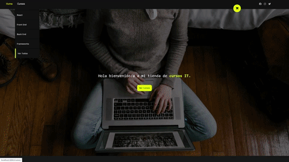

# Coder House Challenge - React

### Desarrollar Ecomerce con React ###


</img>

## Comenzando 🚀

_Se ah creado un usuario realizado un mock simulando una Api muy basica realizando asi peticiones GET a la misma para recuperar los productos._

## Instalación 🔧

Primero debemos instalar las dependencias con npm. Una vez situado en el directorio raiz del proyecto.

```
- Dirigirse al directorio Raiz

- "npm install" para instalar dependencias de desarrollo y produccion.

```

## Desplegando Entorno de Desarrollo React . 📋


_Situado en el directorio se encuentran disponibles los siguientes comandos:_ 

```
"npm start" para lanzar el cliente en la ruta "localhost:3000"

"npm build" para empaquetar el codigo en la carpeta "Build"

"npm test" para lanzar algunos test unitarios del front

```

## Dependencias utilizadas 🛠️

React & React-Router-DOM


